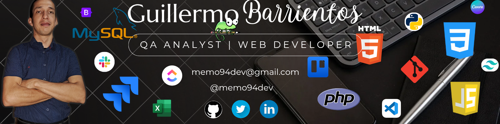
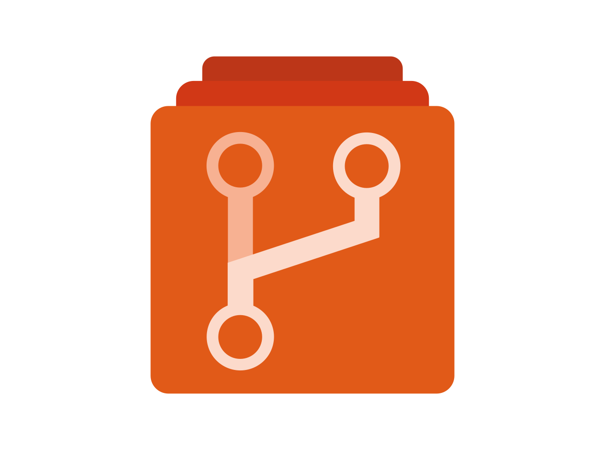
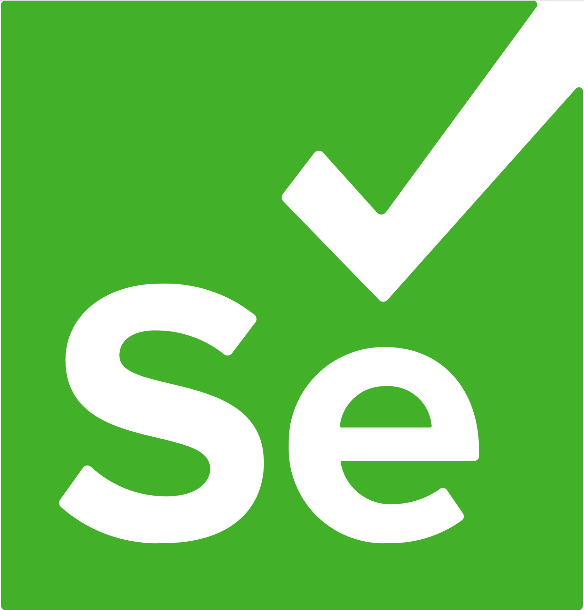
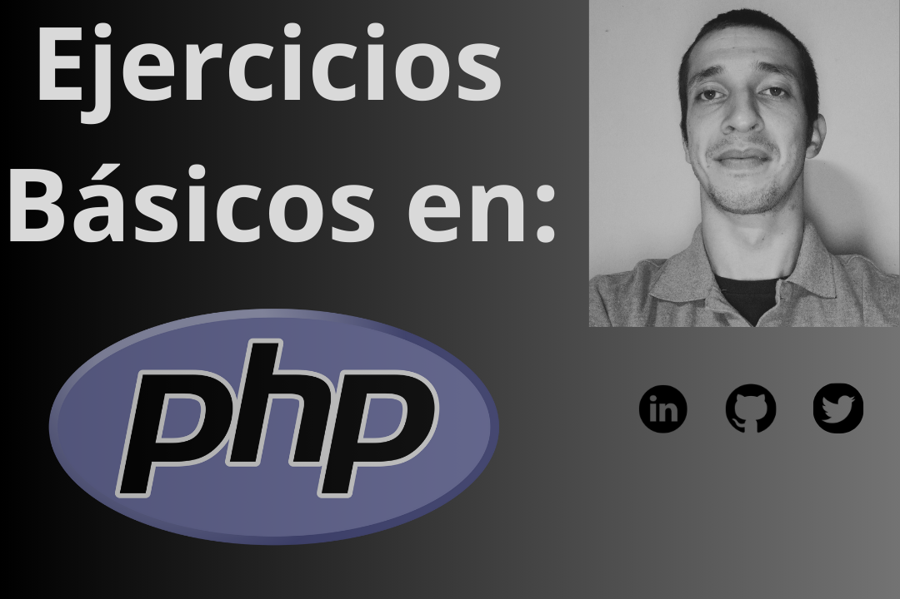
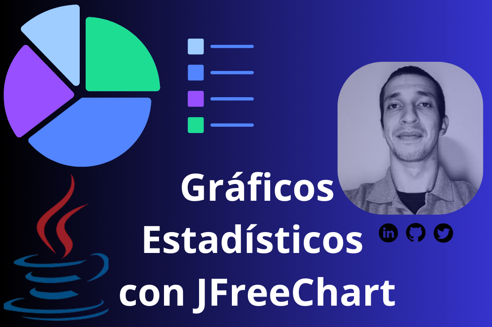

## Bienvenido a mi perfil de Github! 
# Guillermo Barrientos
### QA Analyst | Web Developer
--- 

---
## Sobre Mi:
¡Hola! Mi nombre es **Guillermo Barrientos** y soy un apasionado tester de calidad (QA) con una sólida experiencia de más de dos años en la industria. Actualmente, trabajo para un Banco de renombre donde desempeño el rol de Analista QA, abarcando trabajos desde el análisis y diseño de Casos de Prueba, hasta la preparación y ejecución de los mismos.
## Experiencia Profesional
### Analista QA
#### *(octubre/2023 - Actualidad)*  
•	Responsabilidades:
- Análisis de Requisitos Funcionales, Historias de Usuario y Criterios de Aceptación.
- Diseño de Casos de Pruebas y Estimación de tiempos de Ejecución.
- Conducción y Ejecución de pruebas exhaustivas para garantizar la calidad del software.
- Aplicación de Técnicas de Testing (Partición de Equivalencias, Tabla de Decisiones).
- Aplicación de Testing Funcional y No Funcional (Testing Estático, Smoke Test, Pruebas de Rendimiento).
- Identificación y documentación de errores y problemas potenciales.
- Colaboración con equipos de desarrollo para mejorar la calidad del producto.
### Tester de Calidad (QA)
#### *(enero/2023 - agosto/2023)*  
•	Responsabilidades:
- Conducción de pruebas exhaustivas para garantizar la calidad del software.
- Identificación y documentación de errores y problemas potenciales.
- Colaboración con equipos de desarrollo para mejorar la calidad del producto.
### Implementación y Capacitación de Uso del Sistema
#### *(enero/2023 - agosto/2023)*  
•	Responsabilidades:
-	Despliegue exitoso de sistemas en entornos de producción.
-	Capacitación a usuarios finales para garantizar una adopción efectiva del sistema.
### Soporte al Usuario
#### *(enero/2023 - agosto/2023)*  
•	Responsabilidades:
-	Resolución rápida y eficiente de problemas técnicos.
-	Comunicación efectiva con los usuarios para comprender y abordar sus necesidades.
-	Reporte de errores del sistema en herramientas de Gestión de Proyectos (Trello, Clickup, Jira).
## Educación y Desarrollo Profesional
-  Actualmente, estoy cursando el segundo año de la carrera de Licenciatura en Análisis de Sistemas Informáticos en la [Universidad Tecnológica Intercontinental (UTIC)](https://www.utic.edu.py/v7/).
-	He completado satisfactoriamente el curso de Desarrollado Web del [Grupo IDT](https://www.idt.com.py/) en la modalidad a distancia.
-  Tengo conocimientos sólidos en Excel, desde el nivel Administrativo hasta el Financiero, gracias a los cursos de [ISI Educa](https://isieduca.com/).
-	También fui parte del Bootcamp QA Tester organizado por el MITIC impartido por [Coding Dojo LATAM (Skillnest)](https://www.skillnest.com/).
## Insignias y Certificaciones
| Título | Academia | Ref. |
|--|:--:|:--:|
| [Curso Profesional de Git](https://codigofacilito.com/certificates/591f934a-c4a5-484e-a14b-960719b4733f) | Código Facilito |  |
| [Curso a Fondo de Github](https://codigofacilito.com/certificates/086fb020-5f66-4c2c-8cad-805bb8bdc3a8) | Código Facilito |  |
| [Pruebas en el SDLC](https://codigofacilito.com/certificates/a08ccf77-c692-428d-be11-e45d77b2a07d) | Código Facilito |  |
| [Curso de Introducción al Desarrollo Web (2/2)](https://skillshop.exceedlms.com/student/award/ybe3W1yePMouTRaibU19VW4a) | Google Actívate |  |
| [Curso de Introducción al Desarrollo Web (1/2)](https://skillshop.exceedlms.com/student/award/dQBjEhfMPrMqABFRm5HmPmGr) | Google Actívate |  |
| [Curso de Introducción al Desarrollo Web](https://cursos.desafiolatam.com/certificates/fnc0ax1amy) | Desafío LATAM |  |
| [Introducción a la Programación Orientada a Objetos](https://ed.team/u/memo94dev/curso/poo) | EDTeam |  |
| [Distintivos y Trofeos](https://learn.microsoft.com/es-mx/users/memo94dev/achievements) | Microsoft Learn |  |

## Lenguajes y Herramientas
| Descripción | 1. | 2. | 3. | 4. |
|--|:--:|:--:|:--:|:--:|
| Gestión de Proyectos |  |  |  |  |
| Lenguajes |  |  |  |  |
| Control de Versiones |  |  |  |  |
| Entornos |  |  |  |  |
| API Testing |  |  |  |  |
| Bases de Datos |  |  |  |  |
| Otros |  |  |  |  |

## Objetivos Profesionales
- Mi objetivo es seguir creciendo como profesional en el campo de la tecnología, combinando mis habilidades en pruebas de calidad con el desarrollo web para ofrecer soluciones integrales y de alta calidad a los clientes.
--- 
## Contacto:
- Me puedes contactar al siguiente link:&nbsp;&nbsp; <a href="mailto:memo94dev@gmail.com" style="background-color:crimson; color:white; padding:3px; border-radius: 5px;" title="Enviar Correo">memo94dev</a>

- O a través de mi cuenta de Linkedin:&nbsp;&nbsp; <a href="www.linkedin.com/in/memo94dev" style="background-color:dodgerblue; color:white; padding:3px; border-radius: 5px;" title="Ir a Linkedin">@memo94dev</a>

   &nbsp;&nbsp;&nbsp; &nbsp;&nbsp;&nbsp; &nbsp;&nbsp;&nbsp; &nbsp;&nbsp;&nbsp; 

## Vídeos en [YouTube](https://www.youtube.com/@memo94dev)

<!---
memo94dev/memo94dev is a ✨ special ✨ repository because its `README.md` (this file) appears on your GitHub profile.
You can click the Preview link to take a look at your changes.
--->
